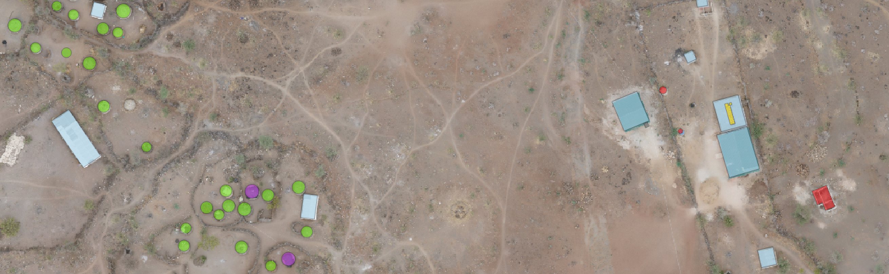

# Introduction
**Jump To:** [Setup](#setup) | [Data](#data-acquisition-and-usage) | [Examples](#examples) | [Acknowledgments](#acknowledgments) | [License](#license)

Building and solar panel identification in aerial imagery for humanitarian mapping.


***Fig 1.** Drone imagery over Kalobeyei Settlement. <span style="color:gold;">Some solar panels</span> and buildings with <span style="color:lightskyblue;">metal sheet</span>, <span style="color:mediumorchid;">plastic</span>, <span style="color:lawngreen;">thatch</span>, and <span style="color:red;">other/unknown</span> roofing are annotated.*

This project automates the identification of buildings and solar panels in aerial imagery, aiding humanitarian mapping. In many developing regions, maps are often outdated or missing, hindering development planning and disaster response. Our work accelerates the creation of up-to-date maps, offering valuable insights into the infrastructure of these areas.

This repository houses models designed for two primary tasks:
1. Detecting buildings and solar panels in aerial imagery. This information can be crucial for infrastructure development planning and humanitarian interventions, as well as for monitoring the adoption of renewable energy sources like solar panels.
2. Classifying the roof materials of buildings. This is particularly important as the type of roofing material can provide information about the building's structure, its age, and even socio-economic indicators.

# Setup
To setup the project, follow these steps:
1. Clone the repository and navigate into the project directory.
2. Create and activate a new conda environment using the provided environment.yml file.
    ```bash
    cd <REPO-NAME>
    conda env create -f environment.yml
    conda activate <ENV-NAME>
    ```
3. Install this repo as a package for easier code imports.
    ```bash
    cd <REPO-NAME>
    pip install -e .
    ```
4. (Optional) Use configuration files and a `.env` file for easier script execution.

    The scripts in this repository take command-line arguments, but it's often easier to store these arguments in configuration files. Example configuration files are provided in `config/`.
    
    For path-related arguments, the example configuration files contain paths relative to this project directory. You can either adjust the relative paths in the configuration files to absolute paths, or use a `root-dir` command-line argument when running scripts. Consider storing these paths as environment variables in a `.env` file. To load environment variables from a `.env` file in Python/Jupyter, you can use the `load_dotenv` function with the path to your .env file: `load_dotenv(dotenv_path='/path/to/your/.env')`. In a bash session, load the .env file with:
    ```bash
    set -a
    source /path/to/your/.env
    set +a
    ```

# Data Acquisition and Usage

This project uses TIFF files of aerial imagery scenes and GeoJSON or GeoPackage files with vector geometries of buildings, solar panels, and other objects of interest. You can use your own data or request a small sample of a dataset collected by USA for UNHCR and the Humanitarian OpenStreetMap Team that is hosted on Azure blob storage:

1. Request a Shared Access Signature (SAS) token. You can do this by contacting USA for UNHCR.

2. Once you have the SAS token, you can use it to access the data on Azure blob storage. Here's an example of how you can do this in Python:

    ```python
    from azure.storage.blob import BlobServiceClient

    sas_token = "<your_sas_token>"
    blob_service_client = BlobServiceClient(account_url="<your_storage_account_url>", credential=sas_token)

    blob_client = blob_service_client.get_blob_client("<your_container_name>", "<your_blob_name>")

    with open("<your_local_path>", "wb") as download_file:
        download_file.write(blob_client.download_blob().readall())
    ```
    Remember to replace `<your_sas_token>`, `<your_storage_account_url>`, `<your_container_name>`, `<your_blob_name>`, and `<your_local_path>` with your actual values.

    The downloaded `raw` data folder contains two subfolders: `imagery` (with aerial scenes) and `annotations` (with one or more GeoJSON files of vector geometries for buildings, solar panels, etc.).

3. After downloading the data, you can use it with the example notebooks in the `examples/` folder.


# Examples
The `examples/` folder contains Jupyter notebooks that guide you through this project:

0. **Data Preprocessing**: Prepares aerial imagery data for modeling, including mosaicking and tiling.
1. **Semantic Segmentation Data Prep**: Creates masks from annotated objects for semantic segmentation models and tiles the masks to match imagery tiles.
2. **Semantic Segmentation Model**: Demonstrates training and inference with the semantic segmentation model.
3. **Roof Classification Data Prep**: Prepares data for roof classification tasks, including extracting roof features and sampling 4-channel chips.
4. **Roof Classification Model**: Shows how to train a roof classification model, examine metrics, and run inference on new data.

# Acknowledgments
This project was made possible through the collaboration of several organizations: [USA for UNHCR](https://www.unrefugees.org/), [UNHCR](https://www.unhcr.org/), [Humanitarian OpenStreetMap Team](https://www.hotosm.org/), and the [Microsoft AI for Good Lab](https://www.microsoft.com/en-us/research/group/ai-for-good-research-lab/).

# License

This project is licensed under the MIT License - see the [LICENSE.md](LICENSE.md) file for details.